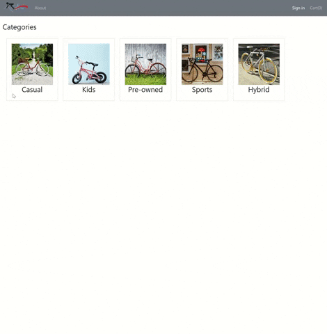
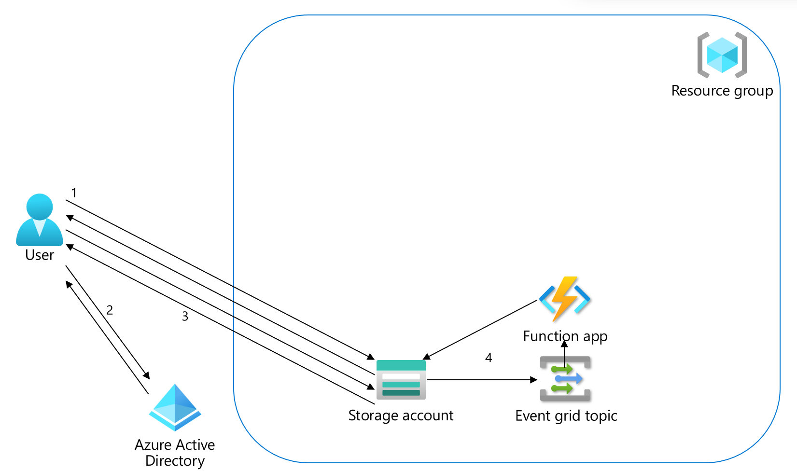
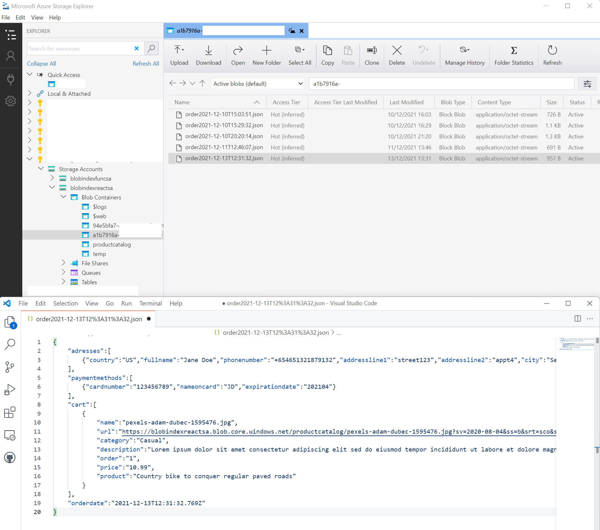

# BlobIndexReact <!-- omit in toc -->

BlobIndexReact is a sample application in React to help Azure customers work with blob storage, tags, index, Azure active directory, role-based access control, and event handlers using Event Grid and Azure Functions. The sample was designed with these design objectives:

- The sample should work with only a storage account; no additional compute or data stores. 
- The sample should work with a modern programming language.
- The sample should demonstrate blob tags and index.
- The sample should be an application development solution beyond the demonstration of a feature.

## Repository contents
| File/folder | Description |
|-------------|-------------|
| `blobs` | Sample data |
| `docs` | Documentation to describe the solution |
| `function` | Azure function to handle blob events from event grid |
| `scripts` | Scripts to deploy the solution | 
| `web` | The single-page application in React |

## Read Me Contents <!-- omit in toc -->

- [Repository Contents](#repository-contents)
- [Problem Statement](#problem-statement)
- [Overview of BlobIndexReact and how it works](#overview-of-blobindexreact-and-how-it-works)
- [BlobIndexReact Components](#blobindexreact-components)
- [BlobIndexReact Implementation](#blobindexreact-implementation)
- [Deploy BlobIndexReact](#deploy-blobindexreact)
- [Monitoring BlobIndexReact](#monitoring-blobindexreact)
- [Contributing](#contributing)

## Problem Statement

Many customers automatically reach out to a web server and database server when designing web applications. This sample demonstrates the capabilities of Azure Storage for both hosting single-page applications as well as unstructured data including images and json objects. 

## Overview of BlobIndexReact and how it works

1. In its simplest for this sample only uses a storage account with two containers; one for the product images and another for the web application. Now the user can browse categories, products, product details and add items to the shopping cart. 

2. Before the user can store data, they have to be authenticated with Azure Active Directory.

3. Directly after signin the application checks whether the user's personal container with permissions exists in the storage account. If it doesn't exist, the application writes a temporary blob to a special container in the storage account.

4. This blob creation triggers an Event Grid event, that is handled by a Function. The Function then creates the user's personal folder, sets the permissions for the user, and deletes the temporary blob.

Now the new user can create orders and read them in their own container. 

This sample focuses on Azure Storage and how to interact with it using javascript/react. If you want to extend it, you can consider adding a proper custom domain, a content delivery network for more efficient delivery of static assets, integrate with Azure Active Directory Business To Consumer for social accounts, set up end-to-end monitoring, add full-text search, etc. 

## BlobIndexReact Components

The web application is a single-page app using React. The sample should be understandable and reuseable for other frameworks in the javascript ecosystem. It extends the AAD React sample that has MsalProvider as it's root, so the security context as available everywhere. Next is the CartContext, which is also available throughout the app, so that in productdetails and cart it can be updated, and the cartsummary in the navbar can also display its content. Lastly there is the pagelayout that loads both the navbar header components as well as the routes in which all screens are rendered. 

Components to be configured: 

authConfig.js - This is where Azure Active Directory integration is configured (clientId and authority/tenant) as well as Azure Storage integration (accountendpoint, readsastoken and createtempblobsastoken).

The function also uses javascript and looks like the syntax in the web application. It contains one function which does three operations. 

## BlobIndexReact Implementation

The implementation of this sample consists of the following topics, that each have their own description:

[Blob index and tags](./docs/blobindex.md)

[Role-based access control](./docs/rbac.md)

[Event handler](./docs/eventhandler.md)

## Deploy BlobIndexReact

[See instructions here](./docs/deploy.md)

## Monitoring BlobIndexReact

[See instructions here](./docs/monitor.md)

## Contributing

This project welcomes contributions and suggestions.  Most contributions require you to agree to a
Contributor License Agreement (CLA) declaring that you have the right to, and actually do, grant us
the rights to use your contribution. For details, visit https://cla.opensource.microsoft.com.

When you submit a pull request, a CLA bot will automatically determine whether you need to provide
a CLA and decorate the PR appropriately (e.g., status check, comment). Simply follow the instructions
provided by the bot. You will only need to do this once across all repos using our CLA.

This project has adopted the [Microsoft Open Source Code of Conduct](https://opensource.microsoft.com/codeofconduct/).
For more information see the [Code of Conduct FAQ](https://opensource.microsoft.com/codeofconduct/faq/) or
contact [opencode@microsoft.com](mailto:opencode@microsoft.com) with any additional questions or comments.

## Trademarks

This project may contain trademarks or logos for projects, products, or services. Authorized use of Microsoft 
trademarks or logos is subject to and must follow 
[Microsoft's Trademark & Brand Guidelines](https://www.microsoft.com/legal/intellectualproperty/trademarks/usage/general).
Use of Microsoft trademarks or logos in modified versions of this project must not cause confusion or imply Microsoft sponsorship.
Any use of third-party trademarks or logos are subject to those third-party's policies.