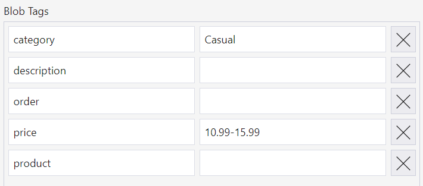
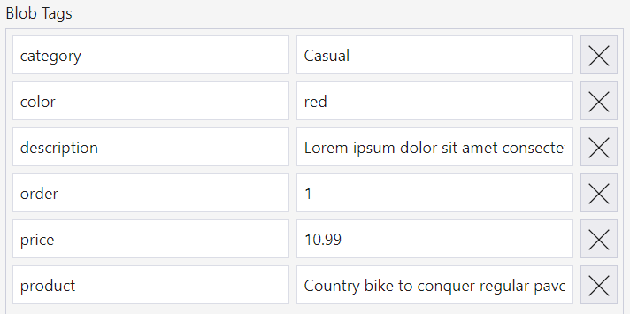

# Blobindexreact - Index and tags <!-- omit in toc -->

## Contents <!-- omit in toc -->

- [Blob index and tags](#blob-index-and-tags)
- [Category and product tags](#category-and-product-tags)
- [Security](#security)

## Blob index and tags

In Azure Storage you can store blobs, files, queue messages and table entities. This sample focuses on blobs or Binary Large OBjects, where they are jpg images and json structured data objects. In Azure Storage blobs have system properties, like name, size and created on date. They can also have user-defined meta data, which are name-value pairs to store additional values. Lastly blobs can have tags, which are also user-defined with the additional benefit that they are indexed. So although you can store the same information with meta data and tags, working with tags is more efficient since you can just search for a tag instead of going over every object and compare meta data to satisfy your search condition.

With that in mind we wanted to demonstrate what you could potentially do with blob tags and index in an application development solution. So we came up with a scenario of a web shop, or any other catalog, where the most important data is the images of items, and the extend them with tags for simple structure and additional information.

In this sample you will see that the tags of category and product are used to find the blobs. Other tags like description, price and color are simply for display purposes. They could be useful in future releases of tags and index when you may be able to search for parts of a text, get price ranges, and get tag keys and their values for filtering.




## Category and product tags

In the sample we are assuming that image blobs will all have a category value. Categories have an empty product value and product do have a value in their product tag. So search query for categories looks like:

```javascript
var partialquery = "product = '' AND category > ''";
```

and the search query for products looks like:

```javascript
var partialquery = "product > '' AND category = '" + categoryname + "'";
```

These partial queries are both used in the generic findBlobs function and extended with a @container to narrow the search to just the catalog container.

```javascript
var query = "@container = '" + catalogContainerName + "' AND " + partialquery;

let iter = blobServiceClient.findBlobsByTags(query);
```

The result is a list of blob items. Since tags are not included in the result, for each of these items call gettags to get their tags and add them to the blob object.

## Security

For completeness you should be aware that so far the user interaction with Azure Storage happens using a SAS token that has read access to the product catalog container. Since Azure Storage security is a topic on its own, take a look at the [rbac page](./rbac.md).

## More info

https://docs.microsoft.com/azure/storage/blobs/storage-blob-index-how-to

https://docs.microsoft.com/azure/storage/blobs/storage-manage-find-blobs