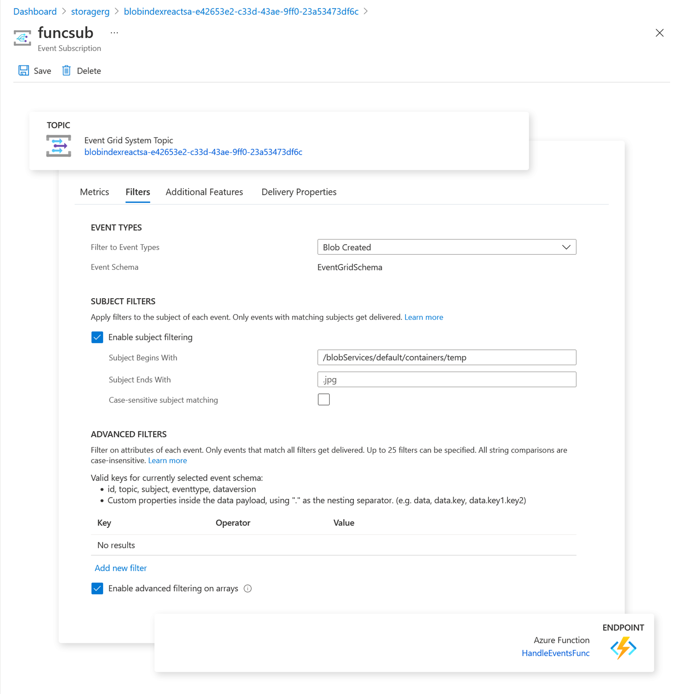
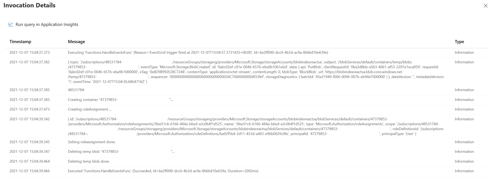

# Blobindexreact - Event handler <!-- omit in toc -->

## Contents <!-- omit in toc -->
- [Event Grid system topic](#event-grid-system-topic)
- [Azure Function](#azure-function)
- [Security](#security)

## Event Grid system topic
Azure Event Grid provides native integration with various event sources to listen to, including Azure Blob Storage, and with various event handlers, including Azure Functions. In this sample we are using this combination to handle the event of a new user signing in the web application to make sure a user-specific storage container exists. It is secured using role-based access control for storage, which works like regular Azure identity and access management where a role is assigned to an identity. In the future this could be a relevant scenario for storage tasks.

In this scenario the web application doesn't know about the user until they sign-in. Once they sign in, they need to get a storage container with permissions to write their orders to and to read them from. This flow is started by the web application creating a temporary blob with name of the user guid. This blob creation is noticed by Event Grid, which then triggers the Function to handle the logic. To be specific the function and the topic only are interested in blob created events in the temp container; other events and containers are not relevant to the function. 

## Azure Function
Azure Functions is also known as serverless compute: a light-weight option to run custom logic. The function is started when it is triggered by Event Grid, which is defined in the binding and configured by the event grid subscription. The function receives the Event Grid event and can then do its logic. In this sample the topic and subject contain all the information the function need to create the container, assign the Storage Blob Data Contributor to the new user and delete the temporary blob that started the flow. 

## Security
For completeness you should be aware that the function interaction with Azure Storage happens using a system managed identity that has access to the control plane and data plane of the storage account. Since Azure Storage security is a topic on its own, take a look at the [rbac page](./rbac.md). 

## More info
https://docs.microsoft.com/azure/event-grid/event-schema-blob-storage
