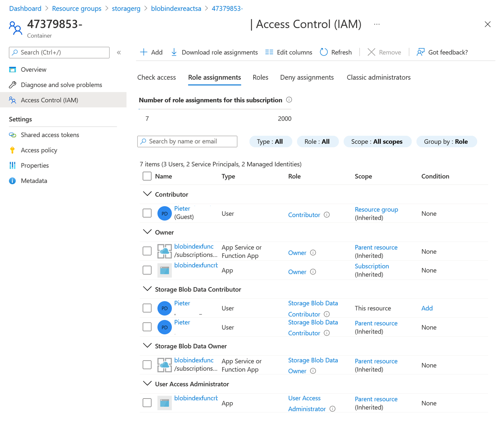

# Blobindexreact - Role-based access control <!-- omit in toc -->

## Contents <!-- omit in toc -->
- [Azure Storage authentication and authorization](#azure-storage-authentication-and-authorization)
- [Access tokens](#access-tokens)
- [SAS tokens](#sas-tokens)
- [RBAC](#rbac)
- [System assigned managed identity](#system-assigned-managed-identity)

## Azure Storage authentication and authorization
There are a number of ways to get access to an Azure Storage account. This sample uses sas tokens, role-based access control for signed-in user in the web application and a system managed identity for the function. For completeness we should also mention that there are many ways to secure and open up storage accounts. 

## Access keys
Access keys are similar to a root password for your storage account. They are probably a bit too powerful for a simple web application. 

## SAS tokens
Shared access signatures also provide anonymous access, however they can do so in a more specific way by providing details on allowed scope, services, permissions and time. 

In this sample there are two SAS tokens. The first SAS token is a read sas to allow anonymous users to browse the catalog. The second is a create sas to write a temporary blob for new users. 

The read SAS is used for browsing the images in the product catalog container. Normally when using listblobs operations you could just use a container level sas token with read and list permissions. Since the browse function in this sample uses blob index and tags and the findblobsbytag operation exists at the service level, you need an account level SAS token with r(ead), l(ist), t(ag) and f(ilter) permissions for the blob service and resource types of service, container and object. For the expiry chose a period that is manageable, which is a tradeoff between how often you want to refresh the token versus for how long can your live with a lost token. 

The create SAS is used to create a temporary blob in a temp container to trigger creation of a user-specific container with permissions, if that doesn't exist yet for the user. For more information on this flow, see the [event handler description](./eventhandler.md). This create SAS can be configured at the temp container level and  needs create permissions. 

## RBAC
Known users will often interact with storage through the identity of a serverside api. In this sample there is a single-page application that connects directly to storage. Role-based access control can be used to authorize those known users in storage. The setup here is that each user will have their own storage container with the name of the user guid. That container also has an RBAC rule that allows only the user to read and write in that container, plus users with permissions at a higher level including subscription, resource group and storage account. 

Before using RBAC with storage, the user has to sign in with Azure Active Directory. AAD integration requires an AAD application registration and authority configured in authConfig.js. This app registration needs to have redirect URIs configured to the locations where the app is running, like localhost and the storage static website url. Also the app registration needs to have API Permissions to use Azure Storage user impersonation. 

Consent message:
This app would like to:
Access Azure Storage As the Signed-in User
View your basic profile
Maintain access to data you have given it access to
Consent on behalf of your organization 

After signing in, the react Microsoft Authentication Library is aware of the signed in user. Next this credential has to be used in the API calls to storage. In this sample that is a  InteractiveBrowserCredential. 

## ABAC
At the moment you can have [a maximum of 2000 Azure RBAC role assignmetns in a subscription](https://docs.microsoft.com/azure/storage/common/storage-auth-abac). In this solution there is one role assignment per user. When you need more, take a look at attribute based access control. For instance, all users could be assigned to a group that is Storage Blob Data Contributor, and then  additional ABAC conditions could be used to allow access based on a blob's userid tag or container name. 

https://docs.microsoft.com/azure/storage/common/storage-auth-abac-examples

https://docs.microsoft.com/azure/storage/common/storage-auth-abac-cli

## System assigned managed identity
The Azure Function creates storage containers, sets role assignments and deletes temporary blobs, for which it needs an identity. The easiest way give an Azure service instance an identity is by using the system assigned managed identity, which means that the management of the identity and secrets is done by Azure. You only need to assign roles, in this case the owner and storage blob data owner, both on the storage account. 

## More info
https://docs.microsoft.com/azure/storage/common/authorize-data-access